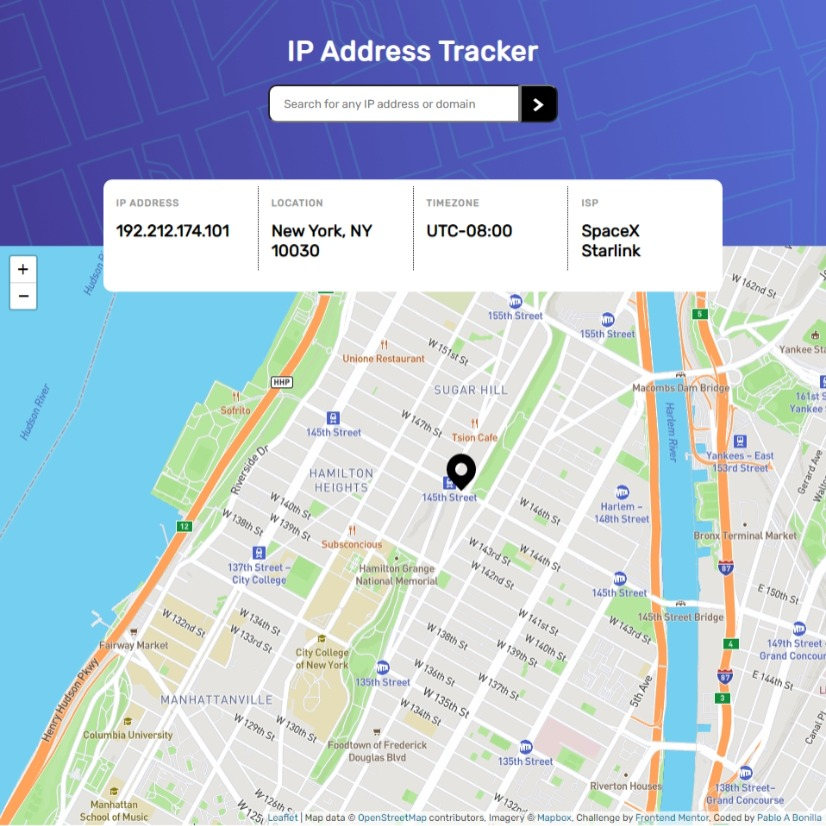

## Table of contents
  - [The challenge](#the-challenge)
  - [Screenshot](#screenshot)
  - [Links](#links)
  - [Built with](#built-with)
  - [What I learned](#what-i-learned)
  - [Continued development](#continued-development)
- [Author](#author)

### The challenge

Users should be able to:

- View the optimal layout for each page depending on their device's screen size
- See hover states for all interactive elements on the page
- See their own IP address on the map on the initial page load
- Search for any IP addresses or domains and see the key information and location

### Screenshot

### Links

- Solution URL: [Repo](https://github.com/Jutsued/ip-address-tracker)
- Live Site URL: [live site URL](https://jutsued.github.io/ip-address-tracker/)

### Built with

- Semantic HTML5 markup
- CSS custom properties
- APIs : Leafletjs, Mapbox, ipify
- Flexbox
- JS(API)

### What I learned

This project helped me improved my js skillS, specially working with api's. API's can be a little confusing(to me) but this project helped me get my foot wet. Now onto the next thing! 

### Continued development

My next API project is gonna be a movie site. Stay near by so you don't miss it.

## Author

- Website - [Pablo A Bonilla](https://github.com/Jutsued)
- Frontend Mentor - [@Jutsued](https://www.frontendmentor.io/profile/Jutsued)

